# @monorepo/client - Next.js Frontend Application

Next.js 14 frontend application built with TypeScript, App Router, Tailwind CSS, and shared types from `@request-response/types`. Part of a monorepo configured for local development using Docker Compose.

## Overview

This project is the frontend client application within a monorepo, located under `apps/client/`. It is built with Next.js and designed to interact with the backend API server (`apps/server`) and potentially other services, all running as Docker containers orchestrated by Docker Compose.

For local development, this service is designed to be run as a Docker container, connecting to the backend API and other services using the Docker network.

## Prerequisites

To run this client using Docker Compose, you need the following installed and available on your local machine:

- **Git**: For cloning the repository.
- **Docker Engine**: The Docker daemon must be running.
- **Docker Compose**: V2 or later is required (often included with Docker Desktop installations).

Having Node.js and npm/yarn/pnpm installed locally is beneficial for running linting, testing, or specific build tasks outside the full Docker Compose stack, but the core client development environment runs within Docker.

## Running the App with Docker Compose

The client is designed to run as part of the larger monorepo stack using Docker Compose.

1. **Clone the monorepo repository**:

   ```bash
   git clone git@github.com:Adamant-Code/monorepo-template.git
   cd monorepo-template
   ```

2. **Set up environment variables**:

   - Create a `.env` file at the root of the monorepo directory (`monorepo-template/.env`). While the client's primary environment variables are in `apps/client/.env`, the root `.env` is the standard location for Docker Compose to load variables.

   For the root `.env`:

   ```env
   # Add any variables needed by Docker Compose itself or shared across services
   # Example:
   # POSTGRES_USER=myuser
   # POSTGRES_PASSWORD=mypassword
   # POSTGRES_DB=app_db
   ```

   - Create or update the `apps/client/.env` file. This file contains environment variables specific to the client application, such as the API URL.

   For `apps/client/.env`:

   ```env
   # apps/client/.env
   NEXTAUTH_URL=http://localhost:3000
   NEXTAUTH_SECRET=your-secure-secret-key
   NEXT_PUBLIC_API_URL=http://localhost:4000
   API_URL=http://server:4000
   ```

3. **Build and start the client service and its dependencies**:

   From the root of the monorepo directory, you can start just the client:

   ```bash
    # Build and start the client service in detached mode (production)
    docker-compose -f docker-compose.yml up --build -d client

    # Build and start the client service in detached mode (development)
    docker-compose -f docker-compose.dev.yml up --build -d client
   ```

   This command will:

   - Build the Docker image for the client service (if needed).
   - Create and start the client container.
   - Create necessary anonymous volumes for `node_modules` and `.next` cache persistence within the container.
   - Start the client application process (`npm run dev`) inside the client container.

   However, the client typically depends on the server and potentially other services. To start the full stack (including server, postgres, redis, etc.), which is the recommended development setup:

   ```bash
    # Build and start all services in detached mode (production)
    docker-compose -f docker-compose.yml up --build -d

    # Build and start all services in detached mode (development)
    docker-compose -f docker-compose.dev.yml up --build -d
   ```

   This command will build and start all services defined in your `docker-compose.yml`. Ensure the server (`apps/server`) is running and accessible at <http://localhost:5000>.

   The client application will be accessible on your host machine at <http://localhost:3000>. Hot-reloading for code changes in `apps/client` and `packages/requestResponse` is enabled via volume mounts.

## Stopping the Client

- To stop just the client service:

  ```bash
    # Stop and remove the client service (production)
    docker-compose -f docker-compose.yml rm -f client

    # Stop and remove the client service (development)
    docker-compose -f docker-compose.dev.yml rm -f client
  ```

- To stop and remove all services defined in `docker-compose.yml`, including networks and default volumes:

  ```bash
    # Stop and remove all services, networks, and containers (production)
    docker-compose -f docker-compose.yml down

    # Stop and remove all services, networks, and containers (development)
    docker-compose -f docker-compose.dev.yml down
  ```

- To stop and remove all services, networks, and named volumes (which will reset database data and installed dependencies, but typically not client `node_modules` or `.next` cache if using anonymous volumes as in the default setup):

  ```bash
    # Stop and remove all services, networks, containers, and named volumes (production)
    docker-compose -f docker-compose.yml down --volumes

    # Stop and remove all services, networks, containers, and named volumes (development)
    docker-compose -f docker-compose.dev.yml down --volumes
  ```

## Development Scripts

While the primary way to run the application stack is via Docker Compose, you can still use npm scripts for specific tasks within the client application or the monorepo root (if you have Node.js installed locally).

From the `apps/client` directory (if Node.js is installed locally):

- `npm run dev`: Start the Next.js development server (runs outside Docker).
- `npm run build`: Build the production Next.js application.
- `npm run start`: Start the production build (runs outside Docker).
- `npm run lint`: Lint the client code.

From the monorepo root directory (if Node.js and Turbo are installed locally):

- `turbo run lint --filter=@monorepo/client`: Lint the client code using Turbo.
- `turbo run build --filter=@monorepo/client`: Build the client using Turbo.

**Note**: When running the full stack with `docker-compose up`, the `npm run dev` command is executed inside the client container, providing the development server environment.

## Common Issues and Solutions

### Cannot Connect to API

- Ensure the server service is running and healthy (`docker-compose ps`, `docker-compose logs server`).
- Verify the `NEXT_PUBLIC_API_URL` in `apps/client/.env` is set correctly to the host-accessible URL of the server (e.g., `http://localhost:5000`).

### Code Changes Not Reflecting (Hot-Reloading)

- Ensure the host volume mounts (`./apps/client:/app/apps/client`, `./packages:/app/packages`) are correctly configured for the client service in `docker-compose.yml`.

### Dependencies Not Found Inside Container

- Ensure `npm install` completes successfully in the client's Dockerfile.
- Verify the anonymous volumes for `node_modules` (`/app/apps/client/node_modules`, `/app/packages/requestResponse/node_modules`) are correctly configured in `docker-compose.yml`. You can try removing and recreating containers (`docker-compose down && docker-compose up --build`) if you suspect volume issues.

## Folder Structure

```bash
apps/client/src
.
├── Dockerfile
├── README.md
├── apps
│   └── client
├── assets
│   ├── button.png
├── next-env.d.ts
├── next.config.mjs
├── package.json
├── postcss.config.mjs
├── public
├── src
│   ├── app
│   │   ├── (auth)
│   │   │   ├── forgot-password
│   │   │   │   └── page.tsx
│   │   │   ├── login
│   │   │   │   └── page.tsx
│   │   │   ├── register
│   │   │   │   └── page.tsx
│   │   │   └── reset-password
│   │   │       └── page.tsx
│   │   ├── api
│   │   │   └── auth
│   │   │       └── [...nextauth]
│   │   │           └── route.ts
│   │   ├── dashboard
│   │   │   └── page.tsx
│   │   ├── favicon.ico
│   │   ├── fonts
│   │   │   ├── GeistMonoVF.woff
│   │   │   └── GeistVF.woff
│   │   ├── layout.tsx
│   │   ├── loading.tsx
│   │   ├── page.tsx
│   │   └── providers
│   │       ├── ErrorBoundary.tsx
│   │       └── SessionProvider.tsx
│   ├── auth.ts
│   ├── components
│   │   ├── Auth
│   │   │   ├── ForgotPassword.tsx
│   │   │   ├── Login.tsx
│   │   │   ├── ProtectedRoute.tsx
│   │   │   ├── Register.tsx
│   │   │   ├── ResetPassword.tsx
│   │   │   └── types
│   │   │       └── index.d.ts
│   │   ├── Button
│   │   │   ├── Button.tsx
│   │   │   └── types
│   │   │       └── index.ts
│   │   ├── Dashboard
│   │   │   ├── Dashboard.tsx
│   │   │   └── types
│   │   │       └── index.d.ts
│   │   ├── DataTable
│   │   │   ├── Columns.tsx
│   │   │   ├── DataTable.tsx
│   │   │   ├── RowActionMenu.tsx
│   │   │   ├── TableBody.tsx
│   │   │   ├── TableContainer.tsx
│   │   │   ├── TableControls.tsx
│   │   │   ├── TableEmptyState.tsx
│   │   │   ├── TableErrorState.tsx
│   │   │   ├── TableHeader.tsx
│   │   │   ├── TableLoader.tsx
│   │   │   ├── TablePagination.tsx
│   │   │   ├── helpers
│   │   │   │   └── index.ts
│   │   │   └── types
│   │   │       └── index.d.ts
│   │   ├── EmailInput
│   │   │   ├── EmailInput.tsx
│   │   │   └── types
│   │   │       └── index.d.ts
│   │   ├── Error
│   │   │   ├── Error.tsx
│   │   │   └── ToastErrorNotifier.tsx
│   │   ├── FileUpload
│   │   │   ├── FileUpload.tsx
│   │   │   ├── types
│   │   │   │   └── index.ts
│   │   │   └── utils
│   │   │       ├── fileValidation.ts
│   │   │       └── preview.ts
│   │   ├── Header
│   │   │   └── Header.tsx
│   │   ├── Home
│   │   │   └── Home.tsx
│   │   ├── Loader
│   │   │   └── Loader.tsx
│   │   ├── LoadingSpinner
│   │   │   └── LoadingSpinner.tsx
│   │   ├── Modal
│   │   │   ├── ConfirmationModal.tsx
│   │   │   └── types
│   │   │       └── index.ts
│   │   ├── PasswordInput
│   │   │   ├── PasswordInput.tsx
│   │   │   └── types
│   │   │       └── index.d.ts
│   │   ├── ReusableComponentWrapper
│   │   │   ├── ComponentWrapper.tsx
│   │   │   ├── ReusableComponentWrapper.tsx
│   │   │   └── ToastComponents.tsx
│   │   ├── SearchableDropdown
│   │   │   ├── SearchableDropdown.tsx
│   │   │   ├── helpers
│   │   │   │   └── index.ts
│   │   │   └── types
│   │   │       └── index.d.ts
│   │   ├── ToggleSwitch
│   │   │   ├── ToggleSwitch.tsx
│   │   │   └── types
│   │   │       └── index.d.ts
│   │   └── UrlInput
│   │       ├── UrlInput.tsx
│   │       └── types
│   │           └── index.d.ts
│   ├── constants
│   │   └── index.ts
│   ├── context
│   │   ├── AuthContext.tsx
│   │   └── ErrorContext.tsx
│   ├── hooks
│   │   ├── useAuth.tsx
│   │   ├── useComponentMounted.tsx
│   │   ├── useError.tsx
│   │   └── useToast.tsx
│   ├── lib
│   │   ├── apiClient.ts
│   │   ├── errors.ts
│   │   └── schemas.ts
│   ├── middleware.ts
│   ├── styles
│   │   ├── globals.css
│   │   └── modal.css
│   └── types
│       ├── auth-context.d.ts
│       ├── form-error.d.ts
│       ├── local-storage.d.ts
│       ├── next-auth.d.ts
│       └── toast.d.ts
├── tailwind.config.ts
└── tsconfig.json
```

## Key Folders

- **app/**: Defines routes, layouts, and API endpoints using Next.js 14 App Router.
- **components/**: UI components like Button.tsx with Tailwind CSS.
- **lib/**: API clients (e.g., lib/api.ts) for server communication, using @request-response/types.
- **utils/**: Helpers like classNames.ts for Tailwind class management.
- **types/**: Placeholder for local types (shared types in @request-response/types).
- **public/**: Static files served at root.
- **styles/**: Global styles with Tailwind CSS.

## Notes

- **TypeScript**: Strict mode with path aliases (@components/_, @lib/_, etc.).
- **Linting**: ESLint enforces React, TypeScript, and Next.js rules.
- **Formatting**: Prettier ensures consistent code style.
- **Tailwind**: Configured for autosuggestions in .tsx files.
- **Deployment**: Builds with turbo run build --filter=@monorepo/client for Vercel.

## Troubleshooting

- Ensure apps/server is running for API routes.
- Check Redis connection for authentication.
- Run npm install in monorepo-template/ if types fail.
- For issues, check logs or update this README with new steps.

## Reusable Components Documentation

This document outlines the usage of reusable components in the `./apps/client` application, built with NextJS 14, TypeScript, and Tailwind CSS. Each component includes a description, props, usage example, and dependencies, designed for easy integration into forms, settings, and other UI elements.

---

### Table of Contents

- [URL Input](#urlinput)
- [Toggle Switch](#toggleswitch)
- [Searchable Dropdown](#searchabledropdown)
- [Password Input](#passwordinput)
- [Email Input](#emailinput)
- [ConfirmationModal](#confirmationmodal)
- [Toast Notication System](#toast)
- [File Upload](#fileupload)
- [Button](#button)
- [Data Table Component](#datatable)

---

### UrlInput

#### Description

A reusable URL input field with an accessible label and error messaging, designed for forms requiring URL inputs (e.g., website fields in registration or profile forms). Built with `@radix-ui/react-label` for accessibility and styled with Tailwind CSS, it supports controlled input values, disabled states, and custom styling.

- **Style Customization**: Use the `className` prop to override default Tailwind styles (e.g., `border`, `background`, `text color`) to match your app’s design system. For example, apply `bg-transparent` or custom colors to blend with your UI.
- **Validation Flexibility**: Integrate with any validation library (e.g., Zod, Yup) or custom validation logic using `onChange`, `onBlur`, and `error` props. Display validation errors dynamically with the `error` prop, making it easy to enforce URL formats or other rules.
- **Label Flexibility**: Exclude the `label` prop to use a custom `<label>` along with the `UrlInput` component within your form

#### Props

| Prop Name     | Type                                               | Default | Required | Description                                                              |
| ------------- | -------------------------------------------------- | ------- | -------- | ------------------------------------------------------------------------ |
| `id`          | `string`                                           | -       | Yes      | Unique ID for the input, used for label and error association.           |
| `label`       | `string`                                           | -       | No       | Label text displayed above the input, appended with a 🌐 emoji.          |
| `error`       | `string`                                           | -       | No       | Error message displayed below the input in red if provided.              |
| `urlValue`    | `string`                                           | -       | Yes      | Controlled value of the input.                                           |
| `onChange`    | `(e: React.ChangeEvent<HTMLInputElement>) => void` | -       | Yes      | Handler for input value changes.                                         |
| `onBlur`      | `(e: React.FocusEvent<HTMLInputElement>) => void`  | -       | No       | Handler for input blur events.                                           |
| `className`   | `string`                                           | ""      | No       | Additional Tailwind CSS classes to override default input styles.        |
| `disabled`    | `boolean`                                          | `false` | No       | Disables the input, applying a grayed-out style.                         |
| `placeholder` | `string`                                           | -       | No       | Placeholder text for the input.                                          |
| ...rest       | `React.InputHTMLAttributes<HTMLInputElement>`      | -       | No       | Other standard HTML input attributes (e.g., `autoComplete`, `required`). |

#### Usage Example

Below is an example of `UrlInput` in a form, using Zod for validation and custom Tailwind styles to override the default appearance. The `onBlur` handler validates the URL with a schema, displaying errors dynamically.

```tsx
"use client";

import { useState } from "react";
import { UrlInput } from "@/components/UrlInput/UrlInput";
import { z } from "zod";

// Example Zod schema (assumed in lib/schemas.ts)
const urlSchema = z.string().url("Please enter a valid URL");

export default function ProfileForm() {
  const [url, setUrl] = useState("");
  const [urlError, setUrlError] = useState<string | undefined>("");

  const handleUrlBlur = () => {
    validateUrl();
  };

  const handleUrlChange = (
    e: React.ChangeEvent<HTMLInputElement>
  ) => {
    validateUrl();
    setUrl(e.target.value);
  };

  const handleUrlKeyDown = (
    e: React.KeyboardEvent<HTMLInputElement>
  ) => {
    if (e.key === "Enter") validateUrl();
  };

  return (
    <div className="p-4">
      <UrlInput
        id="website"
        urlValue={url}
        label="Website URL"
        onBlur={handleUrlBlur}
        onChange={handleUrlChange}
        onKeyDown={handleUrlKeyDown}
        error={!url ? "" : urlError}
        placeholder="www.example.com"
        className="bg-transparent w-full outline-none text-gray-700 placeholder-gray-400"
      />
    </div>
  );
}
```

#### Dependencies

- [`@radix-ui/react-label`](https://www.radix-ui.com/primitives/docs/components/label): For accessible label rendering.
- [Tailwind CSS](https://tailwindcss.com/): For styling (configured in `styles/globals.css`).
- Optional: [Zod](https://zod.dev/) (or other validation libraries like Yup) for form validation, as shown in the example.

#### URL Input Notes

- **Styling**: The default styles (e.g., `border-gray-300`, `border-red-500` for errors) can be fully overridden with `className`. For example, use `bg-transparent` for a minimal look or `text-blue-600` for custom text colors.
- **Validation**: The `error` prop integrates with any validation approach. Combine with `onChange` for real-time validation or `onBlur` for validation on focus loss, as shown with Zod. for the error prop, `error={!url ? "" : urlError}` is passed so it only throws validation error only when typing has started. You can change this to fit your style.
- **Accessibility**: Includes ARIA attributes (`aria-invalid`, `aria-describedby`) and label association via `id`, ensuring WCAG 2.1 compliance.

#### URL Input Screenshots

**URL Input:**

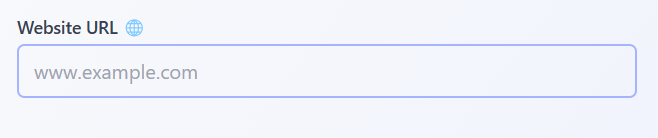

**URL Input invalid state:**:

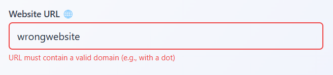

**URL Input valid state:**:

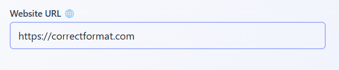

**URL Input disabled state:**:

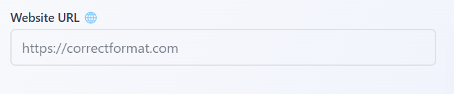

---

### ToggleSwitch

#### ToggleSwitch Description

A reusable toggle switch for boolean inputs, ideal for settings or forms (e.g., enabling/disabling notifications). Built with `@radix-ui/react-switch` for accessibility and styled with Tailwind CSS, it supports controlled state, customizable sizes (`small`, `medium`, `large`), and optional labels. The `className` prop allows overriding default styles to match your app’s design system.

- **Style Customization**: Use the `className` prop to override Tailwind styles (e.g., `bg-blue-600` instead of `bg-indigo-500` for checked state) to align with your UI.
- **Label Flexibility**: Exclude the `label` prop to use a custom `<label>` along with the `ToggleSwitch` component within your form

#### ToggleSwitch Props

| Prop Name         | Type                         | Default | Required | Description                                                        |
| ----------------- | ---------------------------- | ------- | -------- | ------------------------------------------------------------------ |
| `id`              | `string`                     | -       | Yes      | Unique ID for the switch, used for label association.              |
| `checked`         | `boolean`                    | -       | No       | Controlled state of the switch (on/off).                           |
| `onCheckedChange` | `(checked: boolean) => void` | -       | No       | Handler for switch state changes.                                  |
| `label`           | `string`                     | -       | No       | Label text displayed beside the switch. Omit for custom labels.    |
| `className`       | `string`                     | -       | No       | Additional Tailwind CSS classes to override default switch styles. |
| `disabled`        | `boolean`                    | `false` | No       | Disables the switch, applying a grayed-out style.                  |
| `size`            | `'sm'`,`'md'`,`'lg'`,        | `'md'`  | No       | Sets the switch size (small, medium, large).                       |

#### ToggleSwitch Usage Example

Below is an example of `ToggleSwitch` in a settings form, demonstrating both labeled and custom-labeled usage, with large size and custom styling. The component is controlled via state, and the disabled state is shown.

```tsx
"use client";

import { useState } from "react";
import { ToggleSwitch } from "@/components/ToggleSwitch/ToggleSwitch";

export default function SettingsForm() {
  const [isToggled, setIsToggled] = useState(false);

  return (
    <div className="p-4 space-y-4">
      {/* With default label */}
      <ToggleSwitch
        size="lg"
        checked={isToggled}
        id="notifications-lg"
        label="Enable Notifications"
        onCheckedChange={setIsToggled}
        className="bg-blue-600 data-[state=checked]:bg-blue-800"
      />

      {/* With custom label */}
      <div className="flex items-center space-x-3">
        <label
          htmlFor="custom-notifications"
          className="text-sm font-semibold text-indigo-700"
        >
          Custom Notifications
        </label>
        <ToggleSwitch
          size="lg"
          checked={isToggled}
          id="custom-notifications"
          onCheckedChange={setIsToggled}
        />
      </div>

      {/* Disabled state */}
      <ToggleSwitch
        size="lg"
        checked={true}
        disabled={true}
        label="Disabled State"
        id="disabled-notifications"
        onCheckedChange={setIsToggled}
        className="bg-gray-400 data-[state=checked]:bg-gray-600"
      />
    </div>
  );
}
```

#### ToggleSwitch Dependencies

- [`@radix-ui/react-switch`](https://www.radix-ui.com/primitives/docs/components/switch): For accessible switch functionality.
- [`classnames`](https://www.npmjs.com/package/classnames): For conditional class management.
- [Tailwind CSS](https://tailwindcss.com/): For styling (configured in `styles/globals.css`).

#### ToggleSwitch Notes

- **Styling**: Override default styles (e.g., `bg-indigo-500` for checked state) with `className` (e.g., `bg-blue-600`) to match your design system. Use Tailwind’s `data-[state=checked]` for state-specific styles.
- **Label Customization**: Omit the `label` prop and use a custom `<label>` element with `htmlFor` matching the `id` for full control over label appearance or content.
- **Accessibility**: Built with `@radix-ui/react-switch`, ensuring ARIA attributes (`role="switch"`, `aria-checked`) and keyboard navigation (spacebar to toggle), compliant with WCAG 2.1.

#### ToggleSwitch Screenshots

**Toggle Switch:**

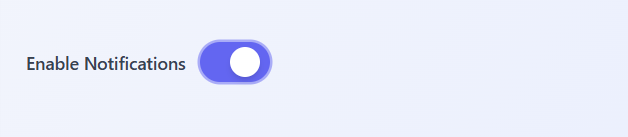

**Toggle Switch disabled state:**

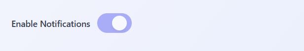

---

### SearchableDropdown

#### SearchableDropdown Description

A reusable dropdown component for single or multi-select scenarios, ideal for forms or settings (e.g., selecting categories or preferences). Built with **react-select** for searchable, accessible dropdown functionality and styled with **Tailwind CSS**, it supports:

- Custom option rendering
- Loading states
- Error messaging
- Disabled states

The `customStyles` helper allows style customization to match your app’s design system.

---

#### SearchableDropdown Props

| Prop Name      | Type                                      | Default       | Required | Description                                           |
| -------------- | ----------------------------------------- | ------------- | -------- | ----------------------------------------------------- |
| `label`        | `string`                                  | -             | No       | Label text displayed above the dropdown.              |
| `options`      | `Array<{ value: string; label: string }>` | `[]`          | No       | Array of selectable items.                            |
| `mode`         | `'single'`,`'multi'`                      | `'single'`    | No       | Sets the dropdown to single or multi-select mode.     |
| `placeholder`  | `string`                                  | `'Search...'` | No       | Placeholder text for the input.                       |
| `disabled`     | `boolean`                                 | `false`       | No       | Disables the dropdown and applies a grayed-out style. |
| `isLoading`    | `boolean`                                 | `false`       | No       | Displays a loading spinner.                           |
| `error`        | `string`                                  | -             | No       | Displays error text below the dropdown in red.        |
| `onChange`     | `(selected: string string[]) => void`     | -             | Yes      | Callback when selection changes.                      |
| `renderOption` | `(option: Option) => React.ReactNode`     | -             | No       | Custom renderer for dropdown options.                 |

---

#### SearchableDropdown Usage Example

```tsx
"use client";

import { useState } from "react";
import { SearchableDropdown } from "@/components/SearchableDropdown/SearchableDropdown";

const options = [
  { value: "1", label: "Apple" },
  { value: "2", label: "Banana" },
  { value: "3", label: "Orange" },
  { value: "4", label: "Pineapple" },
];

const renderOption = (option: { value: string; label: string }) => (
  <div className="flex items-center p-2 hover:bg-indigo-50 rounded-md transition-colors">
    <span className="mr-2 text-indigo-600">🍎</span>
    <span className="font-medium text-gray-800">
      {option.label.toUpperCase()}
    </span>
  </div>
);

export default function PreferencesForm() {
  const [selected, setSelected] = useState<string | string[]>([]);

  return (
    <div className="p-4 space-y-4">
      {/* Single select with custom rendering */}
      <SearchableDropdown
        label="Single Select Fruit"
        mode="single"
        options={options}
        onChange={(value) => {
          setSelected(value);
          console.log("Selected:", value);
        }}
        renderOption={renderOption}
        placeholder="Select your favorite fruit"
      />

      {/* Disabled with error */}
      <SearchableDropdown
        label="Disabled Dropdown"
        mode="single"
        options={options}
        disabled
        error="This dropdown is currently disabled."
        placeholder="Can't touch this"
        onChange={() => {}}
      />

      {/* Multi select */}
      <SearchableDropdown
        label="Multi Select Fruits"
        mode="multi"
        options={options}
        onChange={(values) => {
          setSelected(values);
          console.log("Selected:", values);
        }}
        placeholder="Select your favorite fruits"
      />
    </div>
  );
}
```

#### SearchableDropdown Screenshots

**Multi select state:**

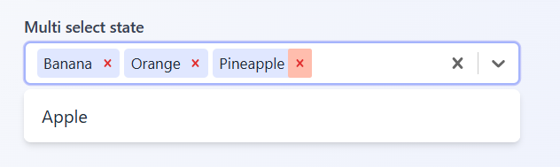

**Render Option:**:

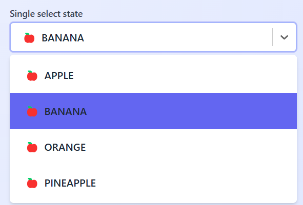

**Single select state:**

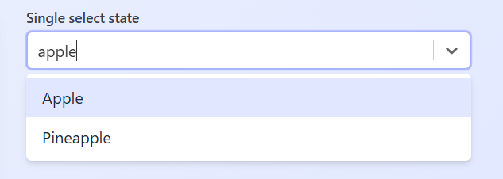

**No options state:**

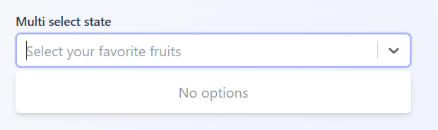

**Error state:**:

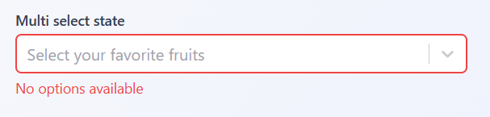

**Loading state:**:

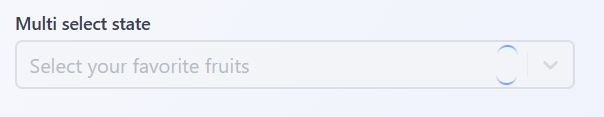

---

#### SearchableDropdown Dependencies

- **react-select**: Provides searchable dropdown functionality.
- **@/hooks/useComponentMounted**: Ensures client-side rendering to avoid SSR issues.
- **@/components/LoadingSpinner/LoadingSpinner**: Custom spinner for loading state.
- **Tailwind CSS**: Used for consistent, utility-first styling (configured in `styles/globals.css`).

---

#### SearchableDropdown Notes

- **Styling**: Modify the `customStyles` helper in `helpers.ts` to change appearance (e.g., borderColor, backgroundColor). You can also pass a `styles` prop to `react-select` directly.
- **Validation**: Use the `error` prop to display validation feedback. In multi-select mode, this works well with external validation logic (e.g., checking if at least one item is selected).
- **Accessibility**: Supports keyboard navigation and includes ARIA attributes like `aria-invalid` and `aria-describedby` to comply with WCAG 2.1, uses `delete` key to remove selected option and `arrow up` and `arrow down` keys to navigate up and down option list.
- **SSR Safety**: Uses `useComponentMounted` to delay rendering until after hydration, preventing SSR-related issues with `react-select`.

### PasswordInput

#### PasswordInput Description

A reusable password input field with a show/hide toggle, strength indicator, and error messaging, designed for authentication forms (e.g., login or registration). Built with **@radix-ui/react-label** and **@radix-ui/react-toggle** for accessibility, and styled with **Tailwind CSS**, it supports controlled input values, disabled states, and custom styling. The strength indicator evaluates password complexity (length, uppercase, numbers, special characters) and is hidden for confirm password fields.

---

#### PasswordInput Props

| Prop Name              | Type                                               | Default | Required | Description                                                         |
| ---------------------- | -------------------------------------------------- | ------- | -------- | ------------------------------------------------------------------- |
| `id`                   | `string`                                           | -       | No       | Unique ID for the input, used for label and error association.      |
| `label`                | `string`                                           | -       | No       | Label text displayed above the input.                               |
| `error`                | `string`                                           | -       | No       | Error message displayed below the input in red.                     |
| `passwordValue`        | `string`                                           | -       | No       | Controlled value of the input.                                      |
| `handlePasswordChange` | `(e: React.ChangeEvent<HTMLInputElement>) => void` | -       | Yes      | Handler for input value changes, supports custom validation.        |
| `confirmPassword`      | `boolean`                                          | -       | No       | Hides the strength indicator for confirm password fields.           |
| `className`            | `string`                                           | ""      | No       | Additional Tailwind CSS classes to override default input styles.   |
| `disabled`             | `boolean`                                          | `false` | No       | Disables the input and toggle, applying a grayed-out style.         |
| ...rest                | `React.InputHTMLAttributes<HTMLInputElement>`      | -       | No       | Other standard HTML input attributes (e.g., placeholder, required). |

---

#### Usage PasswordInput Example

```tsx
"use client";

import { useState } from "react";
import { z } from "zod";
import { PasswordInput } from "@/components/PasswordInput/PasswordInput";
import { Button } from "@/components/Button/Button";

const loginSchema = z.object({
  email: z.string().email("Invalid email address"),
  password: z
    .string()
    .min(8, "Password must be at least 8 characters"),
});

export default function LoginForm() {
  const [formData, setFormData] = useState({ password: "" });
  const [errors, setErrors] = useState<{ password?: string }>({});

  const handleChange = (e: React.ChangeEvent<HTMLInputElement>) => {
    const { name, value } = e.target;
    setFormData((prev) => ({ ...prev, [name]: value }));

    try {
      loginSchema.shape[name as keyof typeof loginSchema.shape].parse(
        value
      );
      setErrors((prev) => ({ ...prev, [name]: undefined }));
    } catch (err) {
      if (err instanceof z.ZodError) {
        setErrors((prev) => ({
          ...prev,
          [name]: err.errors[0].message,
        }));
      }
    }
  };

  const handleSubmit = (e: React.FormEvent) => {
    e.preventDefault();
    try {
      loginSchema.parse(formData);
      console.log("Form submitted:", formData);
    } catch (err) {
      if (err instanceof z.ZodError) {
        const zodErrors = err.flatten().fieldErrors;
        setErrors({
          password: zodErrors.password?.[0],
        });
      }
    }
  };

  return (
    <form
      onSubmit={handleSubmit}
      className="p-8 space-y-6 max-w-md mx-auto"
    >
      <PasswordInput
        required
        id="password"
        name="password"
        label="Password"
        passwordValue={formData.password}
        handlePasswordChange={handleChange}
        error={errors.password}
        placeholder="Enter your password"
        className="w-full rounded-md border border-gray-300 px-4 py-3 focus:ring-1 focus:ring-indigo-300 focus:border-indigo-300"
      />
      <Button
        type="submit"
        buttonName="Sign in"
        className="w-full bg-indigo-600 text-white py-2 rounded-md hover:bg-indigo-700"
      />
    </form>
  );
}
```

---

#### PasswordInput Dependencies

- **@radix-ui/react-label**: For accessible label rendering.
- **@radix-ui/react-toggle**: For the show/hide toggle button.
- **lucide-react**: For Eye and EyeOff icons.
- **Tailwind CSS**: For styling (configured in `styles/globals.css`).
- **Optional**: **zod** (or other validation libraries like Yup) for form validation.

---

#### PasswordInput Notes

- **Validation**: The `error` prop integrates with validation libraries like Zod, using `handlePasswordChange` for real-time validation or `onChange` for additional handling. The strength indicator provides built-in complexity feedback.
- **Accessibility**: Includes ARIA attributes (`aria-invalid`, `aria-describedby`), label association via `id`, and accessible toggle (`aria-label`), ensuring WCAG 2.1 compliance.
- **Strength Indicator**: Hidden when `confirmPassword` is `true`, making it suitable for both password and confirm password fields.

#### PasswordInput Screenshots

**Valid password:**

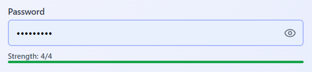

**Invalid password:**:

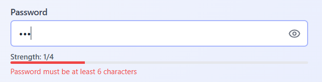

---

### EmailInput

#### EmailInput Description

A reusable email input field with an accessible label and error messaging, designed for authentication or profile forms (e.g., login or registration). Built with `@radix-ui/react-label` for accessibility and styled with Tailwind CSS, it supports controlled input values, disabled states, and custom styling. Ideal for capturing email addresses with validation feedback.

#### EmailInput Prop Details

- **id**: Optional `string` for the input’s unique ID, used for label and error association.
- **label**: Optional `string` displayed above the input to describe its purpose (e.g., "Email Address").
- **error**: Optional `string` for an error message displayed below the input in red.
- **emailValue**: Optional `string` for the controlled input value.
- **className**: Optional `string` of Tailwind CSS classes to override default input styles (e.g., border or background).
- **disabled**: Optional `boolean` (default: `false`) to disable the input, applying a grayed-out style.
- **`...React.InputHTMLAttributes<HTMLInputElement>`**: All other standard HTML input attributes (e.g., `onChange`, `placeholder`, `required`).

#### EmailInput Style Customization

Use the `className` prop to override default Tailwind styles (e.g., `border-gray-300`, `border-red-500` for errors) to match your app’s design system. For example, apply `rounded-lg` or custom colors.

#### EmailInput Validation Flexibility

The `error` prop integrates with any validation library (e.g., Zod, Yup) or custom logic, using `onChange` for real-time validation, as shown with Zod in login forms.

#### EmailInput Props Table

| Prop Name  | Type                                          | Default | Required | Description                                                       |
| ---------- | --------------------------------------------- | ------- | -------- | ----------------------------------------------------------------- |
| id         | `string`                                      | -       | No       | Unique ID for the input, used for label and error association.    |
| label      | `string`                                      | -       | No       | Label text displayed above the input.                             |
| error      | `string`                                      | -       | No       | Error message displayed below the input in red.                   |
| emailValue | `string`                                      | -       | No       | Controlled value of the input.                                    |
| className  | `string`                                      | `""`    | No       | Additional Tailwind CSS classes to override default input styles. |
| disabled   | `boolean`                                     | `false` | No       | Disables the input, applying a grayed-out style.                  |
| ...rest    | `React.InputHTMLAttributes<HTMLInputElement>` | -       | No       | Other standard HTML input attributes.                             |

#### EmailInput Usage Example

```tsx
"use client";

import { useState } from "react";
import { z } from "zod";
import { EmailInput } from "@/components/EmailInput/EmailInput";
import { Button } from "@/components/Button/Button";

// Example Zod schema (assumed in lib/schemas.ts)
const loginSchema = z.object({
  email: z.string().email("Invalid email address"),
  password: z
    .string()
    .min(8, "Password must be at least 8 characters"),
});

export default function LoginForm() {
  const [formData, setFormData] = useState({ email: "" });
  const [errors, setErrors] = useState<{ email?: string }>({});

  const handleChange = (e: React.ChangeEvent<HTMLInputElement>) => {
    const { name, value } = e.target;
    setFormData((prev) => ({ ...prev, [name]: value }));

    try {
      loginSchema.shape[name as keyof typeof loginSchema.shape].parse(
        value
      );
      setErrors((prev) => ({ ...prev, [name]: undefined }));
    } catch (err) {
      if (err instanceof z.ZodError) {
        setErrors((prev) => ({
          ...prev,
          [name]: err.errors[0].message,
        }));
      }
    }
  };

  const handleSubmit = (e: React.FormEvent) => {
    e.preventDefault();
    try {
      loginSchema.parse(formData);
    } catch (err) {
      if (err instanceof z.ZodError) {
        const zodErrors = err.flatten().fieldErrors;
        setErrors({
          email: zodErrors.email?.[0],
        });
      }
    }
  };

  return (
    <form
      onSubmit={handleSubmit}
      className="p-8 space-y-6 max-w-md mx-auto"
    >
      <EmailInput
        required
        name="email"
        label="Email Address"
        emailValue={formData.email}
        onChange={handleChange}
        error={errors.email}
        placeholder="your@email.com"
        className="w-full rounded-md border border-gray-300 px-4 py-3 focus:ring-1 focus:ring-indigo-300 focus:border-indigo-300"
      />
      <Button
        type="submit"
        buttonName="Sign in"
        className="w-full bg-indigo-600 text-white py-2 rounded-md hover:bg-indigo-700"
      />
    </form>
  );
}
```

#### EmailInput Dependencies

- `@radix-ui/react-label`: For accessible label rendering.
- `Tailwind CSS`: For styling (configured in `styles/globals.css`).
- Optional: `zod` (or other validation libraries like Yup) for form validation.

#### EmailInput Notes

- **Validation**: The `error` prop integrates with validation libraries like Zod, using `onChange` for real-time validation.
- **Accessibility**: Includes ARIA attributes (`aria-invalid`, `aria-describedby`) and label association via `id`, ensuring WCAG 2.1 compliance.

#### EmailInput Screenshots

**Valid email:**

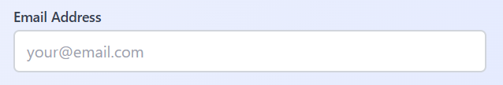

**Invalid email:**:

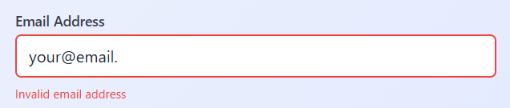

---

### ConfirmationModal

#### ConfirmationModal Description

A reusable modal for confirming user actions (e.g., deleting an item or submitting a form). Built with `react-dom` for portal rendering, `focus-trap-react` for accessibility, and styled with Tailwind CSS, it features a trigger button, animated transitions, keyboard support (Escape to cancel, Enter to confirm), and customizable labels and styles. The modal renders in a portal for proper stacking and focus management.

#### ConfirmationModal Prop Details

- **`title`**: _(string)_ A required string for the modal’s title (e.g., "Confirm Deletion").
- **`description`**: _(string)_ A required string for the modal’s description text.
- **`buttonName`**: _(string, optional)_ A string for the trigger button’s text (default: "Open Modal").
- **`cancelLabel`**: _(string, optional)_ A string for the cancel button’s text (default: "Cancel").
- **`confirmLabel`**: _(string, optional)_ A string for the confirm button’s text (default: "Confirm").
- **`onCancel`**: _(function, optional)_ A callback function invoked when the cancel button or overlay is clicked, or Escape is pressed.
- **`onConfirm`**: _(function, optional)_ A callback function invoked when the confirm button is clicked or Enter is pressed.
- **`className`**: _(string, optional)_ A string of Tailwind CSS classes to customize the modal container’s styles.
- **`cancelButtonClassName`**: _(string, optional)_ A string of Tailwind CSS classes to customize the cancel button’s styles.
- **`confirmButtonClassName`**: _(string, optional)_ A string of Tailwind CSS classes to customize the confirm button’s styles.

#### ConfirmationModal Style Customization

Use `className` to style the modal container (e.g., `bg-gray-100`, `rounded-xl`), `cancelButtonClassName` for the cancel button (e.g., `bg-red-500`), and `confirmButtonClassName` for the confirm button (e.g., `bg-green-600`) to match your app’s design system.

#### ConfirmationModal Validation

As an action confirmation component, it does not involve form validation but supports custom logic via `onCancel` and `onConfirm`.

#### ConfirmationModal Props Table

| Prop Name                | Type       | Default      | Required | Description                                                        |
| ------------------------ | ---------- | ------------ | -------- | ------------------------------------------------------------------ |
| `title`                  | string     | -            | Yes      | Title of the modal.                                                |
| `description`            | string     | -            | Yes      | Description text of the modal.                                     |
| `buttonName`             | string     | "Open Modal" | No       | Text for the trigger button.                                       |
| `cancelLabel`            | string     | "Cancel"     | No       | Text for the cancel button.                                        |
| `confirmLabel`           | string     | "Confirm"    | No       | Text for the confirm button.                                       |
| `onCancel`               | () => void | -            | No       | Callback invoked on cancel (button, overlay click, or Escape key). |
| `onConfirm`              | () => void | -            | No       | Callback invoked on confirm (button or Enter key).                 |
| `className`              | string     | ""           | No       | Tailwind CSS classes for the modal container.                      |
| `cancelButtonClassName`  | string     | ""           | No       | Tailwind CSS classes for the cancel button.                        |
| `confirmButtonClassName` | string     | ""           | No       | Tailwind CSS classes for the confirm button.                       |

#### ConfirmationModal Usage Example

Below is an example of `ConfirmationModal` in a settings page, used to confirm a user action (e.g., deleting a profile). The modal is triggered by a button, and actions are handled with callbacks, demonstrating custom styling.

```tsx
"use client";

import { useState } from "react";
import { ConfirmationModal } from "@/components/ConfirmationModal/ConfirmationModal";

export default function SettingsPage() {
  const [isDeleted, setIsDeleted] = useState(false);

  const handleConfirm = () => {
    setIsDeleted(true);
    console.log("Profile deleted!");
  };

  const handleCancel = () => {
    console.log("Deletion cancelled.");
  };

  return (
    <div className="p-8 max-w-md mx-auto">
      <h1 className="text-2xl font-semibold mb-4">Settings</h1>
      <ConfirmationModal
        title="Confirm Deletion"
        description="Are you sure you want to delete your profile? This action cannot be undone."
        buttonName="Delete Profile"
        cancelLabel="No, Cancel"
        confirmLabel="Yes, Delete"
        onCancel={handleCancel}
        onConfirm={handleConfirm}
        className="bg-gray-50 rounded-xl"
        cancelButtonClassName="px-4 py-2 bg-red-500 text-white rounded-lg hover:bg-red-600"
        confirmButtonClassName="px-4 py-2 bg-green-600 text-white rounded-lg hover:bg-green-700"
      />
      {isDeleted && (
        <p className="mt-4 text-green-600">
          Profile deleted successfully!
        </p>
      )}
    </div>
  );
}
```

#### ConfirmationModal Dependencies

- `react-dom`: For portal rendering to `document.body`.
- `focus-trap-react`: For accessible focus trapping within the modal.
- `Tailwind CSS`: For styling (configured in `styles/globals.css`).

#### ConfirmationModal Notes

- **Styling**: Customize the modal with `className` (e.g., `bg-gray-50`, `rounded-xl`), `cancelButtonClassName` (e.g., `bg-red-500`), and `confirmButtonClassName` (e.g., `bg-green-600`) to align with your design system.
- **Accessibility**: Includes ARIA attributes (`role="dialog"`, `aria-modal`, `aria-labelledby`), focus trapping via `focus-trap-react`, and keyboard support (Escape/Enter), ensuring WCAG 2.1 compliance.
- **SSR Safety**: Uses client-side mounting check (`isMounted`) and `createPortal` to prevent SSR issues.
- **Animations**: Features smooth transitions for opacity and transform, with a 300ms delay on close for a polished UX.

#### ConfirmationModal Screenshots

**Modal:**

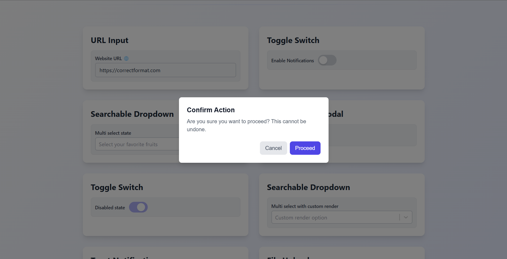

---

### Toast

#### Toast Description

A reusable toast notification system for user feedback, built with react-hot-toast and styled with Tailwind CSS. The useToast hook provides success, error, info, and custom toast methods with customizable styles and action buttons. The ToastErrorNotifier component integrates with the useError hook to automatically display errors from your error handling system. Ideal for form submissions, file uploads, or action confirmations.

#### Toast Components and Hooks

- **useToast Hook**: Returns methods (success, error, info, custom) to trigger toasts with messages or custom content, supporting optional action buttons (e.g., "Undo").
- **ToastErrorNotifier Component**: Listens for errors from useError and displays them as error toasts, clearing errors after display.

#### Toast Props and Hook Parameters

| Name                   | Type                                                                                                | Default                                                                                                       | Required | Description                                                      |
| ---------------------- | --------------------------------------------------------------------------------------------------- | ------------------------------------------------------------------------------------------------------------- | -------- | ---------------------------------------------------------------- |
| **useToast**           | Hook                                                                                                | -                                                                                                             | -        | Returns success, error, info, custom methods for toasts.         |
| **success**            | (message: string, options?: ToastConfig) => void                                                    | -                                                                                                             | No       | Shows a success toast with a green background.                   |
| **error**              | (message: string, options?: ToastConfig) => void                                                    | -                                                                                                             | No       | Shows an error toast with a red background.                      |
| **info**               | (message: string, options?: ToastConfig) => void                                                    | -                                                                                                             | No       | Shows an info toast with a blue background and info icon.        |
| **custom**             | (content: React.ReactNode, options?: ToastConfig) => void                                           | -                                                                                                             | No       | Shows a toast with custom content.                               |
| **ToastConfig**        | { duration?: number, style?: React.CSSProperties, action?: { label: string, onClick: () => void } } | { duration: 4000, style: { padding: "12px 16px", borderRadius: "8px", maxWidth: "400px", fontSize: "14px" } } | No       | Config for toast duration, styles, and action button.            |
| **ToastErrorNotifier** | Component                                                                                           | -                                                                                                             | No       | No props; uses `useError` to display and clear errors as toasts. |

#### Toast Style Customization

Customize toasts via ToastConfig's style (e.g., background, color) or override default styles (bg-green-100 for success, bg-red-100 for error, bg-blue-100 for info). Action buttons use Tailwind classes (bg-blue-600, hover:bg-blue-700).

#### Toast Validation Integration

ToastErrorNotifier displays errors from useError, while useToast supports validation feedback (e.g., in FileUpload or Login) by showing error messages with actionable retries.

#### Toast Usage Example

Below is an example of useToast and ToastErrorNotifier in a dashboard, showing success, error, and info toasts with action buttons, and automatic error notifications. The ToastComponents wrapper demonstrates triggering toasts, while ToastErrorNotifier handles errors from useError.

```jsx
"use client";

import { useError } from "@/hooks/useError";
import useToast from "@/hooks/useToast";
import ToastErrorNotifier from "@/components/ToastErrorNotifier/ToastErrorNotifier";

export default function Dashboard() {
  const { setError } = useError();
  const { success, error, info } = useToast();

  const handleUndo = () => {
    console.log("Undo action triggered");
  };

  const triggerError = () => {
    setError(new Error("Failed to save settings"));
  };

  return (
    <div className="p-8 max-w-md mx-auto">
      <h1 className="text-2xl font-semibold mb-4">
        Dashboard Notifications
      </h1>
      {/* Automatic error notifications */}
      <ToastErrorNotifier />

      {/* Toast triggers */}
      <div className="space-y-4">
        <div>
          <label className="text-sm font-medium text-gray-700">
            Success Toast
          </label>
          <button
            className="px-4 py-2 bg-green-500 text-white rounded-lg hover:bg-green-600"
            onClick={() =>
              success("Settings saved!", {
                action: { label: "Undo", onClick: handleUndo },
              })
            }
          >
            Show Success
          </button>
        </div>
        <div>
          <label className="text-sm font-medium text-gray-700">
            Error Toast
          </label>
          <button
            className="px-4 py-2 bg-red-500 text-white rounded-lg hover:bg-red-600"
            onClick={() =>
              error("Failed to save.", {
                action: { label: "Retry", onClick: handleUndo },
              })
            }
          >
            Show Error
          </button>
        </div>
        <div>
          <label className="text-sm font-medium text-gray-700">
            Info Toast
          </label>
          <button
            className="px-4 py-2 bg-blue-500 text-white rounded-lg hover:bg-blue-600"
            onClick={() =>
              info("Check your settings.", {
                action: { label: "View", onClick: handleUndo },
              })
            }
          >
            Show Info
          </button>
        </div>
        <div>
          <label className="text-sm font-medium text-gray-700">
            Trigger Error
          </label>
          <button
            className="px-4 py-2 bg-gray-500 text-white rounded-lg hover:bg-gray-600"
            onClick={triggerError}
          >
            Trigger Error
          </button>
        </div>
      </div>
    </div>
  );
}
```

#### Toast Dependencies

- **react-hot-toast**: For toast notifications.
- **Tailwind CSS**: For styling (configured in styles/globals.css).
- **@/hooks/useError**: Custom hook for error state management (used by ToastErrorNotifier).

#### Toast Notes

- **Styling**: Customize toasts via ToastConfig's style (e.g., background: #ff0000) or override defaults (bg-green-100 for success, bg-red-100 for error). Action buttons use Tailwind (bg-blue-600, hover:bg-blue-700).
- **Validation Integration**: ToastErrorNotifier displays errors from useError, while useToast supports validation feedback (e.g., FileUpload errors) with actionable toasts.
- **Accessibility**: Toasts are ARIA-compatible via react-hot-toast, with dismissible action buttons for keyboard users.
- **Usage**: Use useToast for manual toasts (e.g., in FileUpload) and ToastErrorNotifier for global error handling (e.g., in app/layout.tsx or Dashboard).

#### Toast Screenshots

**Manual toast feedback:**

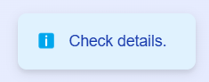

**Toast with action button:**


**Toast gloabl error notifier:**

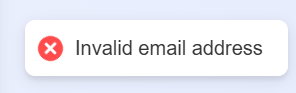

---

### FileUpload

#### FileUpload Description

A reusable file upload component with drag-and-drop support, file previews, progress bars, and toast notifications, ideal for forms or user profiles (e.g., uploading images or PDFs). Built with `react-dropzone` for file handling, `next/image` for image previews, and `react-hot-toast` for feedback, it supports multiple file uploads, validation (type and size), and a remove feature. Styled with Tailwind CSS for a modern, accessible UI.

#### FileUpload Props

| Prop Name           | Type                                           | Default               | Required | Description                                                |
| ------------------- | ---------------------------------------------- | --------------------- | -------- | ---------------------------------------------------------- |
| `accept`            | `string[]`                                     | `["image/*", ".pdf"]` | No       | Array of allowed file types (e.g., `["image/*", ".pdf"]`). |
| `maxSizeMB`         | `number`                                       | `5`                   | No       | Maximum file size in megabytes.                            |
| `multiple`          | `boolean`                                      | `false`               | No       | Allows multiple file uploads.                              |
| `disabled`          | `boolean`                                      | `false`               | No       | Disables the upload area, applying a grayed-out style.     |
| `onFilesSelected`   | `(files: File[]) => void`                      | -                     | Yes      | Callback invoked with successfully uploaded files.         |
| `handleFilesRemove` | `handleFilesRemove: (fileName:string) => void` | No                    | Yes      | Callback invoked to deleted uploaded or failed uploads     |

#### FileUpload Style Customization

Customize the dropzone, previews, and buttons using Tailwind classes directly in the component's markup (e.g., `border-dashed`, `bg-blue-50` for drag active, `text-red-600` for remove button). Override styles by wrapping the component or modifying its classes.

#### FileUpload Validation Flexibility

The `validateFiles` utility checks file types and sizes, displaying errors via `useToast`. Integrate with custom validation logic by extending `validateFiles` or handling errors in `onFilesSelected`.

#### FileUpload Usage Example

Below is an example of `FileUpload` in a profile form, allowing users to upload images or PDFs with previews and a remove feature. The component uses toast notifications for feedback and tracks uploaded files via state.

```tsx
"use client";

import { useState } from "react";
import { FileUpload } from "@/components/FileUpload/FileUpload";

export default function ProfileForm() {
  const [uploadedFiles, setUploadedFiles] = useState<File[]>([]);

  const handleFilesSelected = (files: File[]) => {
    setUploadedFiles((prev) => [...prev, ...files]);
    console.log(
      "Uploaded files:",
      files.map((f) => f.name)
    );
  };

  return (
    <div className="p-8 max-w-md mx-auto">
      <h1 className="text-2xl font-semibold mb-4">Upload Files</h1>
      <FileUpload
        accept={["image/*", ".pdf"]}
        maxSizeMB={5}
        multiple={true}
        disabled={false}
        onFilesSelected={handleFilesSelected}
      />
      {uploadedFiles.length > 0 && (
        <div className="mt-4">
          <h2 className="text-lg font-medium">Uploaded Files:</h2>
          <ul className="list-disc pl-5">
            {uploadedFiles.map((file) => (
              <li
                key={file.name}
                className="text-gray-600"
              >
                {file.name}
              </li>
            ))}
          </ul>
        </div>
      )}
    </div>
  );
}
```

#### FileUpload Dependencies

- `react-dropzone`: For drag-and-drop file handling.
- `next/image`: For rendering image previews.
- `react-hot-toast`: For toast notifications (via `useToast` hook).
- Tailwind CSS: For styling (configured in `styles/globals.css`).

#### FileUpload Notes

- **Styling**: Customize the dropzone (`border-dashed`, `bg-blue-50` when active), previews (`w-16 h-16`), and remove button (`text-red-600`) by modifying Tailwind classes in the component or wrapping it with custom styles.
- **Validation**: The `validateFiles` utility enforces file type and size constraints, with errors shown via `useToast`. Extend validation by modifying `validateFiles` or adding checks in `onFilesSelected`.
- **Accessibility**: Includes ARIA attributes (`aria-label` for input, `role="progressbar"` for progress bars) and keyboard support via `react-dropzone`, ensuring WCAG 2.1 compliance.
- **Cleanup**: Automatically revokes blob URLs for previews on file removal or component unmount to prevent memory leaks.
- **Upload**: This component currently uses a simulated upload for testing purpose. Should be replaced with real uplaod function.

#### FileUpload Screenshots

**File Upload:**

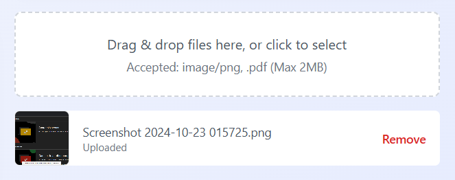

**File Upload Failed State:**:

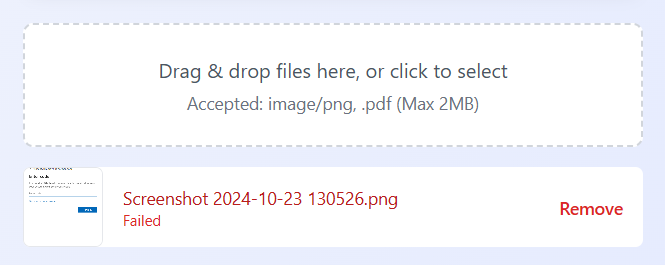

**File Upload Multi:**

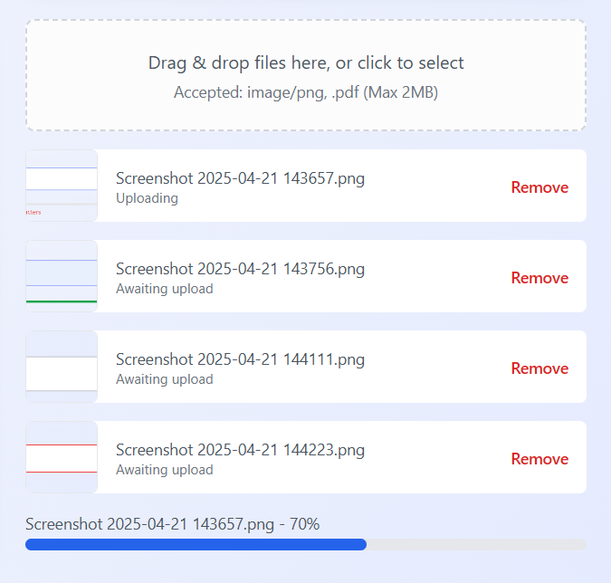

---

### Button

#### Button Description

A reusable button component with support for loading states, ideal for forms or actions (e.g., submitting a login form or triggering modals). Styled with Tailwind CSS, it features a customizable appearance, a loading spinner, and accessibility attributes. The button supports standard HTML button types (button, submit, reset) and disables during loading.

#### Button Props

| Prop Name   | Type                                            | Default      | Required | Description                                                        |
| ----------- | ----------------------------------------------- | ------------ | -------- | ------------------------------------------------------------------ |
| type        | `"button" \| "submit" \| "reset"`               | -            | Yes      | Specifies the HTML button type.                                    |
| buttonName  | string                                          | -            | Yes      | Text displayed on the button when not loading.                     |
| className   | string                                          | ""           | No       | Tailwind CSS classes to override default button styles.            |
| isLoading   | boolean                                         | false        | No       | Shows a loading spinner and disables the button.                   |
| loadingText | string                                          | "Loading..." | No       | Text displayed during loading.                                     |
| isDisabled  | boolean                                         | false        | No       | Disables the button independently of isLoading.                    |
| ...         | `React.ButtonHTMLAttributes<HTMLButtonElement>` | -            | No       | Other standard HTML button attributes (e.g., onClick, aria-label). |

#### Button Style Customization

Use className to override default styles (e.g., bg-indigo-600, text-white, hover:bg-indigo-700) to match your app's design system (e.g., bg-green-600, rounded-lg).

#### Button Usage Example

Below is an example of Button in a login form, integrated with EmailInput and PasswordInput, showing loading state and custom styling. The button submits the form and displays a spinner during processing.

```tsx
"use client";

import { useState } from "react";
import { z } from "zod";
import { Button } from "@/components/Button/Button";
import { EmailInput } from "@/components/EmailInput/EmailInput";
import { PasswordInput } from "@/components/PasswordInput/PasswordInput";

// Example Zod schema (assumed in lib/schemas.ts)
const loginSchema = z.object({
  email: z.string().email("Invalid email address"),
  password: z
    .string()
    .min(8, "Password must be at least 8 characters"),
});

export default function LoginForm() {
  const [formData, setFormData] = useState({
    email: "",
    password: "",
  });
  const [isLoading, setIsLoading] = useState(false);
  const [errors, setErrors] = useState<{
    email?: string;
    password?: string;
  }>({});

  const handleChange = (e: React.ChangeEvent<HTMLInputElement>) => {
    const { name, value } = e.target;
    setFormData((prev) => ({ ...prev, [name]: value }));

    try {
      loginSchema.shape[name as keyof typeof loginSchema.shape].parse(
        value
      );
      setErrors((prev) => ({ ...prev, [name]: undefined }));
    } catch (err) {
      if (err instanceof z.ZodError) {
        setErrors((prev) => ({
          ...prev,
          [name]: err.errors[0].message,
        }));
      }
    }
  };

  const handleSubmit = async (e: React.FormEvent) => {
    e.preventDefault();
    setIsLoading(true);
    try {
      loginSchema.parse(formData);
      // Simulate API call
      await new Promise((resolve) => setTimeout(resolve, 2000));
      console.log("Form submitted:", formData);
    } catch (err) {
      if (err instanceof z.ZodError) {
        const zodErrors = err.flatten().fieldErrors;
        setErrors({
          email: zodErrors.email?.[0],
          password: zodErrors.password?.[0],
        });
      }
    } finally {
      setIsLoading(false);
    }
  };

  return (
    <form
      onSubmit={handleSubmit}
      className="p-8 space-y-6 max-w-md mx-auto"
    >
      <EmailInput
        required
        name="email"
        label="Email Address"
        emailValue={formData.email}
        onChange={handleChange}
        error={errors.email}
        placeholder="your@email.com"
      />
      <PasswordInput
        required
        id="password"
        name="password"
        label="Password"
        passwordValue={formData.password}
        handlePasswordChange={handleChange}
        error={errors.password}
        placeholder="Enter your password"
      />
      <Button
        type="submit"
        buttonName="Sign in"
        isLoading={isLoading}
        loadingText="Signing in..."
        className="w-full bg-indigo-600 text-white py-3 rounded-md hover:bg-indigo-700"
      />
    </form>
  );
}
```

#### Button Dependencies

- Tailwind CSS: For styling (configured in styles/globals.css).

#### Button Notes

- **Styling**: Override default styles (bg-indigo-600, hover:bg-indigo-700, disabled:bg-indigo-300) with className (e.g., bg-green-600, rounded-lg) to match your design system.
- **Accessibility**: Includes ARIA-compatible spinner and supports standard button attributes (e.g., aria-label, aria-disabled), ensuring WCAG 2.1 compliance.
- **Loading State**: Displays a spinner and loadingText when isLoading is true, with automatic disabling to prevent multiple submissions.

#### Button Screenshots

**Button:**

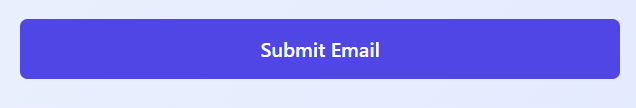

**Button Loading State:**:

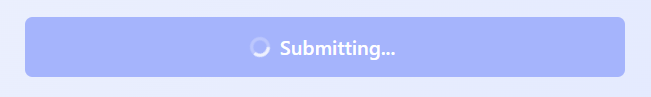

---

### DataTable

#### DataTable Description

The DataTable component is a customizable table. It handles data presentation with advanced features including pagination, sorting, filtering, searching, row selection, and virtualization for large datasets. The component supports both client-side and server-side data processing.

#### DataTable Key Features

- **Virtualized Rendering**: Efficiently handles large datasets with optimized DOM rendering
- **Sorting**: Column-based sorting with visual indicators
- **Filtering**: Column-specific filters through popover interfaces
- **Global Search**: Quick filtering across all columns
- **Pagination**: Standard pagination controls with customizable page sizes
- **Row Selection**: Selection of individual or all rows with support for bulk actions
- **Column Visibility**: Toggle columns via dropdown menu
- **Responsive Design**: Mobile-friendly layout adaptations
- **Custom Styling**: Extensive theming capabilities via className props
- **Server-side Processing**: Optional API integration for handling large datasets
- **Loading, Empty, and Error States**: Customizable UI states
- **Keyboard Navigation**: Accessibility features like keyboard shortcuts (More to be added.)

#### DataTable Basic Usage

```jsx
"use client";

import { DataTable } from "./components/DataTable";
import { createColumnHelper } from "@tanstack/react-table";

// Define your data type
type User = {
  id: string;
  name: string;
  email: string;
  createdAt: string;
  role: "admin" | "user";
};

// Sample data
const data: User[] = [
  {
    id: "1",
    role: "admin",
    name: "John Doe",
    email: "john@example.com",
    createdAt: "2023-01-15T12:00:00Z",
  },
  // More data...
];

// Define your columns
// You don't have to wrap it in a function if you don't
// an action button that uses call functions for actions
export function getColumns<TData extends { id: string }>(
  onEdit?: (row: TData) => void,
  onDelete?: (id: string) => void
): ColumnDef<TData>[] {
  return [
    {
      header: "Role",
      enableSorting: true,
      accessorKey: "role",
      cell: (info) => info.getValue(),
    },
    {
      header: "Name",
      enableSorting: true,
      accessorKey: "name",
      cell: (info) => info.getValue(),
    },
    {
      header: "Email",
      enableSorting: true,
      accessorKey: "email",
      cell: (info) => info.getValue(),
    },
    {
      header: "Created At",
      enableSorting: true,
      accessorKey: "createdAt",
      cell: (info) => info.getValue(),
    },
    {
      id: "actions",
      header: "Actions",
      enableHiding: false,
      enableSorting: false,
      cell: ({ row }) => (
        <RowActionMenu
          onEdit={() => onEdit?.(row.original)}
          onDelete={() => onDelete?.(row.original.id)}
        />
      ),
    },
  ];
}


export default function UsersPage() {
  return (
    <div className="container mx-auto py-10">
      <h1 className="text-2xl font-bold mb-5">Users</h1>
      <DataTable
        data={data}
        columns={getColumns(onEdit, onDelete)}
        onRowClick={(row) => console.log("Clicked row:", row)}
      />
    </div>
  );
}
```

---

#### DataTable Advanced Configuration

##### DataTable Server-side Data Processing

```jsx
import { useState } from "react";
import { DataTable } from "./components/DataTable";
import {
  DataTableFetchOptions,
  DataTableFetchResponse,
} from "./components/types";

export default function ServerSideTablePage() {
  // Server-side fetch function
  async function fetchUserData(
    options: DataTableFetchOptions
  ): Promise<DataTableFetchResponse<User>> {
    const {
      page,
      sortBy,
      filters,
      pageSize,
      searchQuery,
      sortDirection,
    } = options;

    try {
      // Build your API URL with query parameters
      const url = new URL("/api/users", window.location.origin);
      url.searchParams.append("page", page.toString());
      url.searchParams.append("size", pageSize.toString());
      if (sortBy) url.searchParams.append("sortBy", sortBy);
      if (sortDirection)
        url.searchParams.append("sortDir", sortDirection);
      if (searchQuery) url.searchParams.append("search", searchQuery);

      // Add any column filters
      if (filters) {
        Object.entries(filters).forEach(([key, value]) => {
          if (value)
            url.searchParams.append(
              `filter[${key}]`,
              value.toString()
            );
        });
      }

      const response = await fetch(url);
      const result = await response.json();

      return {
        data: result.data,
        pageCount: result.pageCount,
        totalCount: result.totalCount,
      };
    } catch (err) {
      console.error("Error fetching data:", err);
      return {
        data: [],
        pageCount: 0,
        totalCount: 0,
        error: "Failed to load data. Please try again.",
      };
    }
  }

  // You can use the apiClient wrapper to perform same function
  // This is preferrable as errors would be caught and handled
  async function fetchUserData(
    options: DataTableFetchOptions
  ): Promise<DataTableFetchResponse<User>> {
    const {
      page,
      sortBy,
      filters,
      pageSize,
      searchQuery,
      sortDirection,
    } = options;

    try {
      // Build query parameters object for axios
      const params: Record<string, string> = {
        page: page.toString(),
        size: pageSize.toString(),
      };

      if (sortBy) params.sortBy = sortBy;
      if (sortDirection) params.sortDir = sortDirection;
      if (searchQuery) params.search = searchQuery;

      // Add any column filters
      if (filters) {
        Object.entries(filters).forEach(([key, value]) => {
          if (value) params[`filter[${key}]`] = value.toString();
        });
      }

      // Make the request using apiClient
      const response = await apiClient.get("/users", { params });
      const result = response.data;

      return {
        data: result.data,
        pageCount: result.pageCount,
        totalCount: result.totalCount,
      };
    } catch (err) {
      console.error("Error fetching data:", err);
      // You can call the toast error function here as well
      return {
        data: [],
        pageCount: 0,
        totalCount: 0,
        error:
          err instanceof HTTPError
            ? err.message
            : "Failed to load data. Please try again.",
      };
    }
  }

  return (
    <div className="container mx-auto py-10">
      <h1 className="text-2xl font-bold mb-5">
        Server-side Data Processing
      </h1>
      <DataTable
        columns={columns}
        defaultPageSize={25}
        fetchData={fetchUserData}
        enableServerSideProcessing={true}
      />
    </div>
  );
}
```

##### **Table**

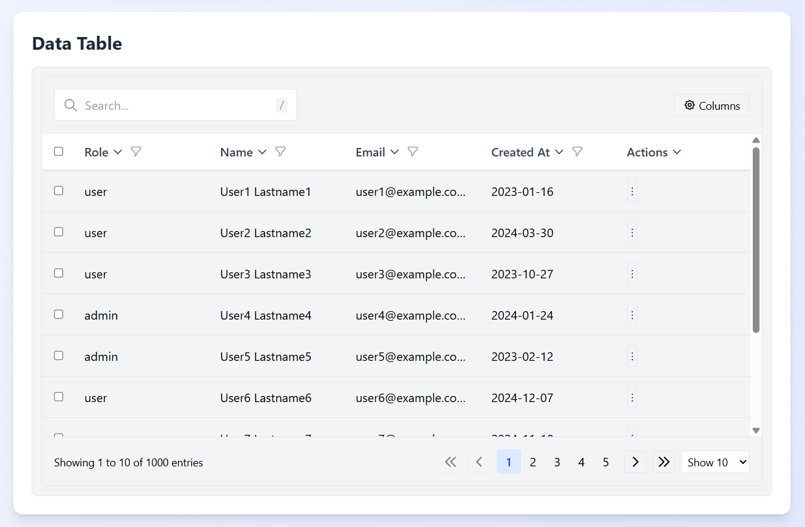

---

#### DataTable Row Selection with Bulk Actions

```jsx
export default function RowSelectionPage() {
  const handleDelete = (rows: User[]) => {
    console.log("Deleting rows:", rows);
    // Implement your delete logic other actions
  };

  const handleSelectionChange = (selectedRows: User[]) => {
    console.log("Selection changed:", selectedRows);
    // Update your UI based on selection
  };

  return (
    <DataTable
      data={data}
      columns={columns}
      enableRowSelection={true}
      onBulkDelete={handleDelete}
      onSelectionChange={handleSelectionChange}
    />
  );
}
```

#### **Bulk Delete**

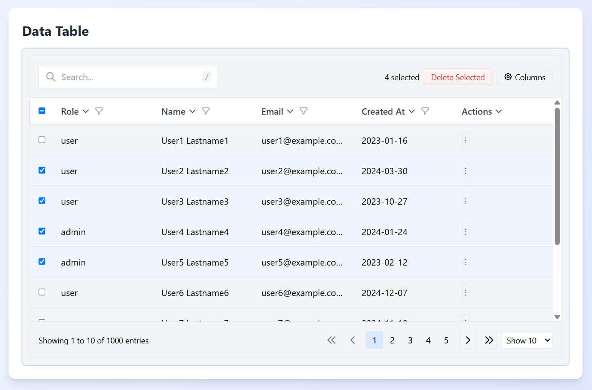

#### Custom Cell Rendering

```jsx
const columns = [
  // ... other columns
  columnHelper.accessor("status", {
    header: "Status",
    cell: (info) => {
      const status = info.getValue();
      return (
        <span
          className={`px-2 py-1 rounded text-xs font-medium
          ${
            status === "active"
              ? "bg-green-100 text-green-800"
              : status === "pending"
              ? "bg-yellow-100 text-yellow-800"
              : "bg-red-100 text-red-800"
          }`}
        >
          {status}
        </span>
      );
    },
  }),

  columnHelper.display({
    id: "actions",
    header: "Actions",
    cell: (info) => (
      <div className="flex space-x-2">
        <button
          onClick={(e) => {
            e.stopPropagation();
            handleEdit(info.row.original);
          }}
          className="text-blue-600 hover:text-blue-800"
        >
          Edit
        </button>
        <button
          onClick={(e) => {
            e.stopPropagation();
            handleDelete(info.row.original.id);
          }}
          className="text-red-600 hover:text-red-800"
        >
          Delete
        </button>
      </div>
    ),
  }),
];

// You can use this for flexibility.
// Abstract the JSX syntax for cleaner code
export function getColumns<TData extends { id: string }>(
  onEdit?: (row: TData) => void,
  onDelete?: (id: string) => void
): ColumnDef<TData>[] {
  return [
    {
      header: "Role",
      enableSorting: true,
      accessorKey: "role",
      cell: (info) => info.getValue(),
    },
    {
      header: "Name",
      enableSorting: true,
      accessorKey: "name",
      cell: (info) => {
        const status = info.getValue() as string;
        return (
          <span
            className={`px-2 py-1 rounded text-xs font-medium
            ${
              status === "active"
                ? "bg-green-100 text-green-800"
                : status === "pending"
                ? "bg-yellow-100 text-yellow-800"
                : "bg-red-100 text-red-800"
            }`}
          >
            {status}
          </span>
        );
      },
    },
    {
      header: "Email",
      enableSorting: true,
      accessorKey: "email",
      cell: (info) => info.getValue(),
    },
    {
      header: "Created At",
      enableSorting: true,
      accessorKey: "createdAt",
      cell: (info) => info.getValue(),
    },
    {
      id: "actions",
      header: "Actions",
      enableHiding: false,
      enableSorting: false,
      cell: ({ row }) => (
        <RowActionMenu
          onEdit={() => onEdit?.(row.original)}
          onDelete={() => onDelete?.(row.original.id)}
        />
      ),
    },
  ];
}

```

#### **Custom Cell Rendering**

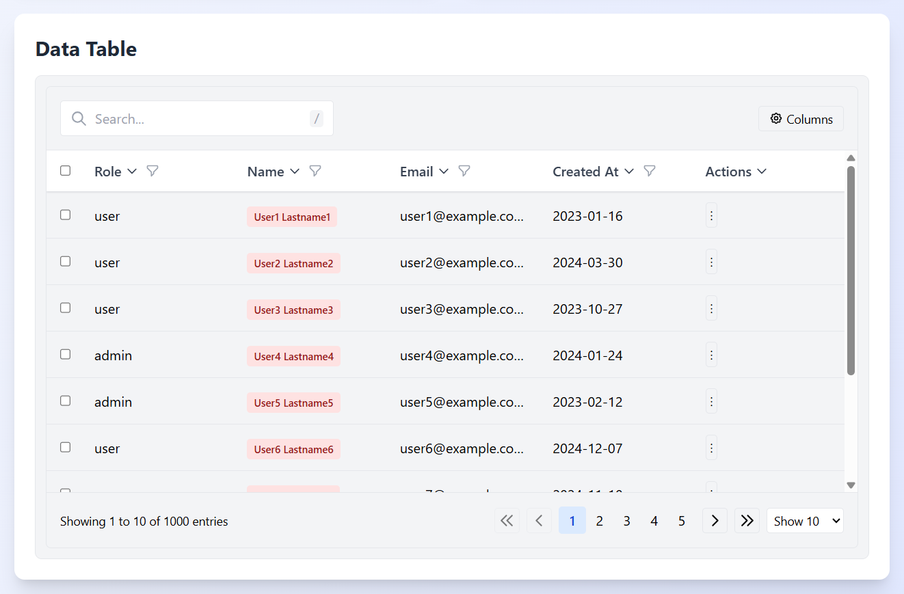

---

#### Custom Empty and Error States

```jsx
// Make it clean by defining the components in separate files
<DataTable
  columns={columns}
  data={data}
  emptyStateComponent={
    <div className="flex flex-col items-center justify-center p-8">
      
      <h3 className="mt-4 text-lg font-medium">No records found</h3>
      <p className="mt-1 text-sm text-gray-500">
        Add new records to see them here.
      </p>
      <button className="mt-4 px-4 py-2 bg-blue-600 text-white rounded">
        Add New Record
      </button>
    </div>
  }
  errorStateComponent={
    <div className="flex flex-col items-center justify-center p-8 text-red-600">
      <svg
        className="w-12 h-12"
        fill="none"
        viewBox="0 0 24 24"
        stroke="currentColor"
      >
        <path
          strokeLinecap="round"
          strokeLinejoin="round"
          strokeWidth={2}
          d="M12 8v4m0 4h.01M21 12a9 9 0 11-18 0 9 9 0 0118 0z"
        />
      </svg>
      <h3 className="mt-4 text-lg font-medium">Error loading data</h3>
      <p className="mt-1 text-sm text-gray-500">
        Please try again or contact support.
      </p>
      <button className="mt-4 px-4 py-2 bg-red-600 text-white rounded">
        Retry
      </button>
    </div>
  }
/>
```

#### Default Error, Loading and Empty States

```jsx
// Loading State using default loader
<DataTable
  isLoading
  data={users}
  onBulkDelete={handleDelete}
  columns={getColumns(onEdit, onDelete)}
  onSelectionChange={handleSelectionChange}
/>
```

#### **Loading State**

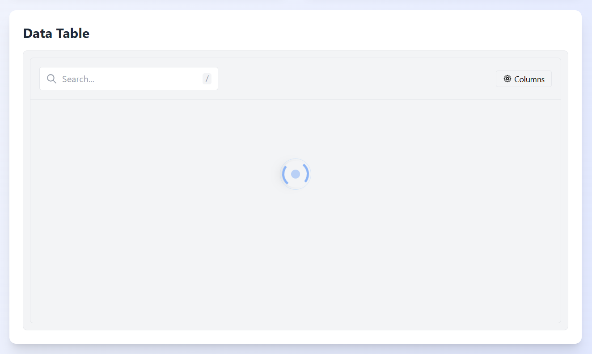

```jsx
// Error State using default error component
<DataTable
  isError
  isLoading
  data={users}
  onBulkDelete={handleDelete}
  columns={getColumns(onEdit, onDelete)}
  onSelectionChange={handleSelectionChange}
  errorMessage="Oops, something unexpected just happened"
/>
```

#### **Error State**

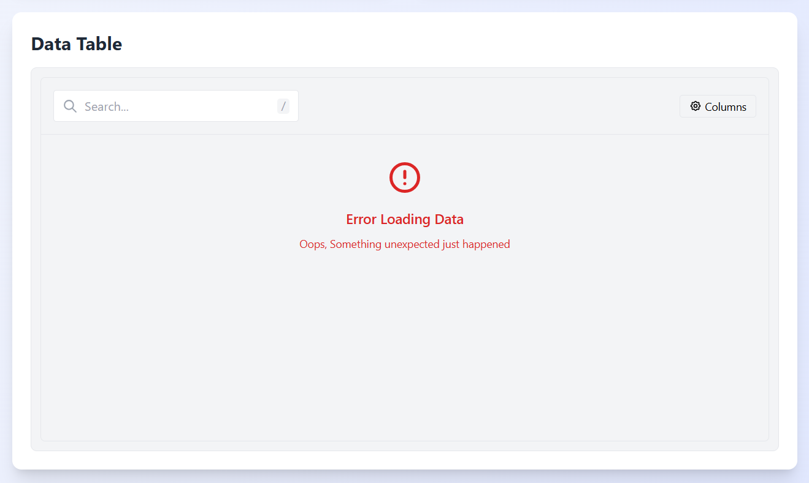

```jsx
// Empty State using default empty component
<DataTable
  isLoading
  data={[]}
  onBulkDelete={handleDelete}
  columns={getColumns(onEdit, onDelete)}
  onSelectionChange={handleSelectionChange}
/>
```

#### **Empty State**

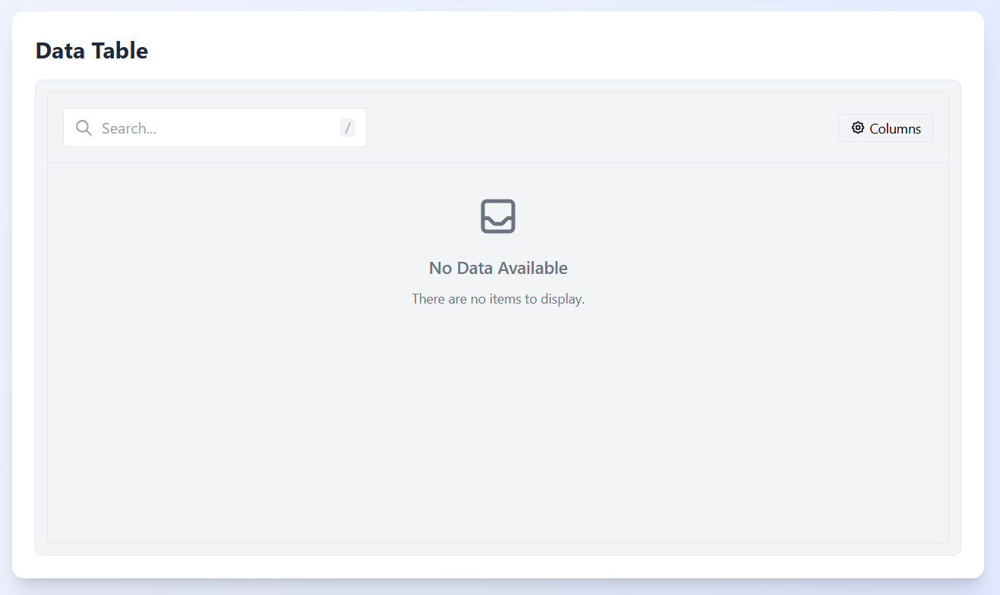

#### API Reference

#### DataTable Props

| Prop                         | Type                                                                         | Default      | Description                                                   |
| ---------------------------- | ---------------------------------------------------------------------------- | ------------ | ------------------------------------------------------------- |
| `columns`                    | `ColumnDef<TData, TValue>[]`                                                 | **Required** | Defines table columns structure                               |
| `data`                       | `TData[]`                                                                    | `[]`         | Data to display in table (client-side)                        |
| `fetchData`                  | `(options: DataTableFetchOptions) => Promise<DataTableFetchResponse<TData>>` | `undefined`  | Function for server-side data fetching                        |
| `enableServerSideProcessing` | `boolean`                                                                    | `false`      | Use server-side processing for pagination, sorting, filtering |
| `enableSearch`               | `boolean`                                                                    | `true`       | Show global search field                                      |
| `enableSorting`              | `boolean`                                                                    | `true`       | Enable column sorting                                         |
| `enableFiltering`            | `boolean`                                                                    | `true`       | Enable column-specific filtering                              |
| `enablePagination`           | `boolean`                                                                    | `true`       | Show pagination controls                                      |
| `enableRowSelection`         | `boolean`                                                                    | `true`       | Enable row selection with checkboxes                          |
| `enableVirtualization`       | `boolean`                                                                    | `true`       | Use virtualization for optimized rendering                    |
| `enableColumnVisibility`     | `boolean`                                                                    | `true`       | Allow toggling column visibility                              |
| `className`                  | `string`                                                                     | `''`         | Root element class name                                       |
| `bodyHeight`                 | `number`                                                                     | `400`        | Table body height (for scrolling)                             |
| `rowClassName`               | `string`                                                                     | `''`         | Class name for table rows                                     |
| `cellClassName`              | `string`                                                                     | `''`         | Class name for table cells                                    |
| `tableClassName`             | `string`                                                                     | `''`         | Class name for table element                                  |
| `headerClassName`            | `string`                                                                     | `''`         | Class name for header rows                                    |
| `paginationClassName`        | `string`                                                                     | `''`         | Class name for pagination controls                            |
| `hideControls`               | `boolean`                                                                    | `false`      | Hide the top control panel                                    |
| `defaultPageSize`            | `number`                                                                     | `10`         | Default number of rows per page                               |
| `initialSortBy`              | `{ id: string; desc: boolean }[]`                                            | `[]`         | Initial sorting configuration                                 |
| `onRowClick`                 | `(row: TData) => void`                                                       | `undefined`  | Handler for row click events                                  |
| `onBulkDelete`               | `(rows: TData[]) => void`                                                    | `undefined`  | Handler for bulk deletion                                     |
| `onSelectionChange`          | `(rows: TData[]) => void`                                                    | `undefined`  | Handler called when selection changes                         |
| `isLoading`                  | `boolean`                                                                    | `false`      | External loading state indicator                              |
| `isError`                    | `boolean`                                                                    | `false`      | External error state indicator                                |
| `errorMessage`               | `string`                                                                     | `''`         | Custom error message                                          |
| `emptyStateComponent`        | `React.ReactNode`                                                            | `undefined`  | Custom empty state component                                  |
| `errorStateComponent`        | `React.ReactNode`                                                            | `undefined`  | Custom error state component                                  |
| `loadingStateComponent`      | `React.ReactNode`                                                            | `undefined`  | Custom loading state component                                |

#### DataTableFetchOptions

| Property        | Type                      | Description                   |
| --------------- | ------------------------- | ----------------------------- |
| `page`          | `number`                  | Current page number (1-based) |
| `pageSize`      | `number`                  | Number of items per page      |
| `sortBy`        | `string` (optional)       | Column ID to sort by          |
| `sortDirection` | `'asc'` or `'desc'`       | Sort direction                |
| `searchQuery`   | `string` (optional)       | Global search query           |
| `filters`       | `Record<string, unknown>` | Column-specific filter values |

#### DataTableFetchResponse

| Property     | Type                | Description                            |
| ------------ | ------------------- | -------------------------------------- |
| `data`       | `TData[]`           | Data items to display                  |
| `pageCount`  | `number`            | Total number of pages available        |
| `totalCount` | `number`            | Total number of items across all pages |
| `error`      | `string` (optional) | Error message if fetch failed          |

#### Implementation Details

#### Architecture

The DataTable is composed of several specialized components:

1. **DataTable**: Main component that orchestrates state and rendering
2. **TableControls**: Contains search input, bulk actions, and column visibility controls
3. **TableContainer**: Manages the table structure, virtualization, and row rendering
4. **TablePagination**: Handles pagination controls
5. **TableLoader/Error/EmptyState**: Specialized display components for different states

#### Server-side Processing

The component supports server-side operations through the `fetchData` prop, which should return a Promise resolving to a `DataTableFetchResponse`. This enables efficient handling of large datasets by offloading filtering, sorting, and pagination to the server.

When `enableServerSideProcessing` is `true`, the component:

1. Calls `fetchData` when search, sort, filter, or pagination changes
2. Passes all the necessary parameters through `DataTableFetchOptions`
3. Updates the table based on the response

#### Virtualization

For large datasets, virtualization improves performance by rendering only visible rows. The component:

1. Uses `@tanstack/react-virtual` to track visible items
2. Creates spacer elements for proper scrolling
3. Only renders rows that are visible in the viewport
4. Automatically disables virtualization for small datasets

#### Best Practices

1. **Performance Optimization**:

   - Use server-side processing for datasets exceeding 1,000 records
   - Enable virtualization for tables with many rows
   - Keep column definitions simple for better render performance

2. **Responsive Design**:

   - Use percentage-based widths or responsive classes
   - Set `bodyHeight` appropriately for different screen sizes
   - Consider hiding less important columns on smaller screens

3. **Accessibility**:

   - Maintain proper table semantics with `<table>`, `<thead>`, and `<tbody>`
   - Provide clear labels for interactive elements
   - Test keyboard navigation thoroughly

4. **Error Handling**:
   - Always provide clear error states and recovery options
   - Implement retry logic for failed data fetches
   - Log detailed errors for troubleshooting

#### Common Customizations

#### Custom Column Definitions

```jsx
const columns = [
  // Standard text column
  columnHelper.accessor("name", {
    header: "Name",
    cell: (info) => info.getValue(),
    // Enable/disable features at column level
    enableSorting: true,
    enableFiltering: true,
  }),

  // Date formatting
  columnHelper.accessor("createdAt", {
    header: "Date",
    cell: (info) => {
      const date = new Date(info.getValue());
      return date.toLocaleDateString();
    },
  }),

  // Custom component rendering
  columnHelper.accessor("status", {
    header: "Status",
    cell: (info) => <StatusBadge status={info.getValue()} />,
  }),

  // Action buttons
  columnHelper.display({
    id: "actions",
    header: "Actions",
    cell: (info) => (
      <ActionButtons
        onEdit={() => handleEdit(info.row.original)}
        onDelete={() => handleDelete(info.row.original.id)}
      />
    ),
    // Disable features for this column
    enableSorting: false,
    enableFiltering: false,
  }),
];
```

#### Custom Styling

```jsx
<DataTable
  columns={columns}
  data={data}
  className="bg-white shadow-md rounded-lg"
  tableClassName="bg-white"
  headerClassName="bg-gray-50 text-gray-700"
  rowClassName="hover:bg-blue-50 transition-colors"
  cellClassName="py-3"
  paginationClassName="bg-gray-50 border-t"
  bodyHeight={500}
/>
```

#### DataTable Troubleshooting

1. **Table doesn't render any data**

   - Check that your data array is not empty
   - Verify column definitions match your data structure
   - Look for console errors in the browser

2. **Flickering during scrolling**

   - Increase the overscan value in the virtualization configuration
   - Check for complex cell renderers that might cause performance issues
   - Consider reducing the number of rendered columns

3. **Server-side data not loading properly**

   - Verify your `fetchData` function returns the expected response format
   - Check network requests for proper parameters
   - Add error handling and logging to debug API calls

4. **Row selection not working**
   - Ensure `enableRowSelection` is set to `true`
   - Check that each data item has a unique `id` property
   - Verify no event propagation issues in custom cell renderers

### DataTable Screenshots

#### **Column Filtering**

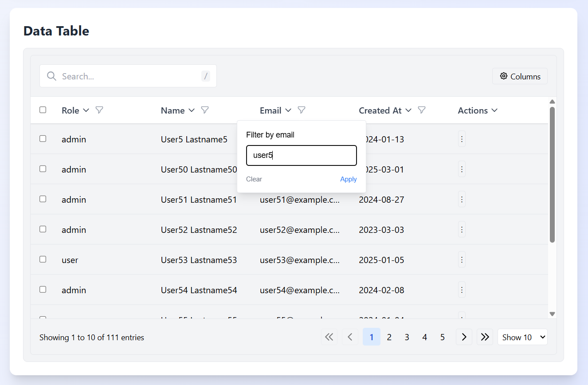

#### **Global Search**

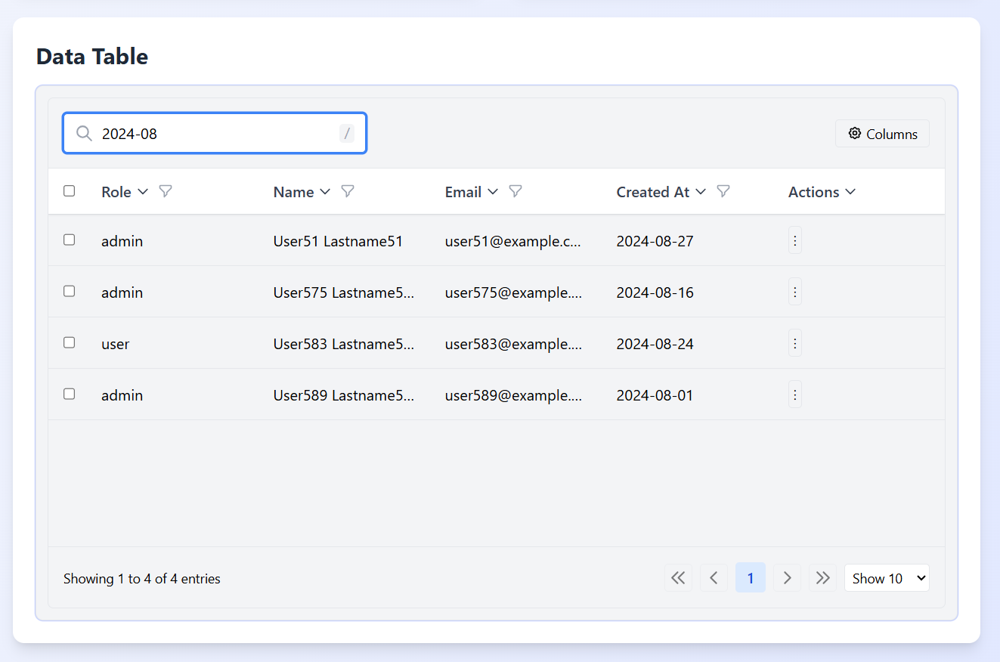

#### **Action Button**

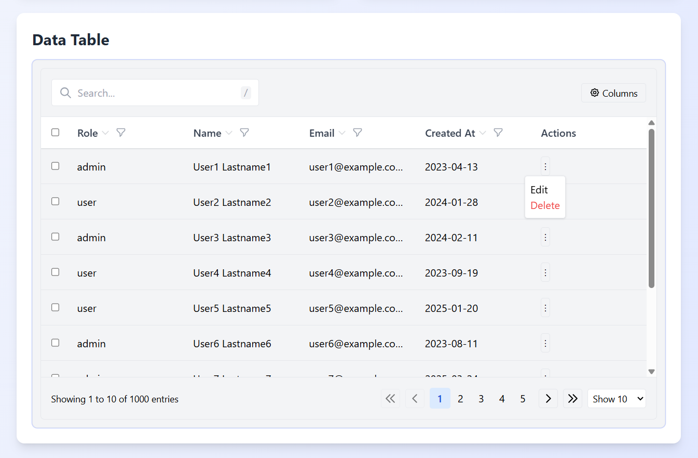

#### Conclusion

The DataTable component provides a comprehensive solution for displaying, sorting, filtering, and paginating tabular data. Its flexible API allows for extensive customization while maintaining performance with advanced features like virtualization and server-side processing.

---
